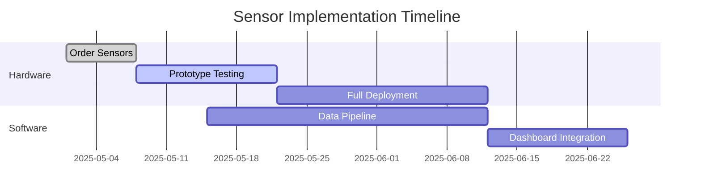

# Secret Trees Horizon Europe Grant Preparation Plan

## **1. Research Integration Strategy**

### **Documentation Updates**

- **Update `01-Carbon-Methodology.md`** with TÜV SÜD verification costs and RTU study data
- **Revise `04-Legal-Compliance.md`** with latest MiCA utility token classification details
- **Enhance `03-Technical-Implementation.md`** with sensor specs and Baltic climate adjustments


### **Version Control Protocol**

```bash
git checkout -b grant-application
git add .
git commit -m "Integrate Horizon research findings"
git push origin grant-application
```


---

## **2. Horizon Europe CL5-2027-D5-01 Application**

### **Key Application Requirements**

| Requirement | Secret Trees Alignment | Evidence Location |
| :-- | :-- | :-- |
| Green Deal Priority | Carbon-negative construction | `01-Carbon-Methodology.md` |
| Digital Innovation | Blockchain/IoT integration | `05-Digital-Platform.md` |
| SME Participation | Partnership with Latvian Hemp Association | `06-Business-Model.md` |
| Budget Scale | €1.2M request for 10 cottages | `04-Funding-Strategy.md` |

### **Proposed Work Packages**

1. **WP1: Hemp Supply Chain Automation** (€450k)
    - Robotic decortication system implementation
    - Local farmer training program
2. **WP2: AI Verification System** (€300k)
    - Federated learning model development
    - GDPR-compliant data pipeline
3. **WP3: Scalable Construction** (€400k)
    - Modular hempcrete prefab system
    - Baltic climate durability testing
4. **WP4: Dissemination** (€50k)
    - EU-wide "Grow Your House" workshop series

---

## **3. Technical Implementation Roadmap**

### **IoT Sensor Deployment**




### **Smart Contract Updates**

```solidity
// Updated with reentrancy protection
function mintCarbonToken(address to, uint256 id, uint256 amount) 
    public 
    nonReentrant 
{
    require(verifiers[msg.sender], "Caller not authorized");
    _mint(to, id, amount, "");
}
```


---

## **4. Collaborative Workflow**

### **Team Permissions Matrix**

| Role | Docs Access | Code Access | Grant Sections |
| :-- | :-- | :-- | :-- |
| Technical Lead | Full | Main+Grant branches | WP2, WP3 |
| Legal Advisor | /Legal | None | Compliance |
| Grant Writer | /Business | None | All sections |
| DAO Representative | /Governance | Read-only | WP4 |

### **Version Control Strategy**

- **Main Branch**: Stable documentation + code
- **Grant-Application**: All Horizon-related changes
- **Feature Branches**: Technical implementations

---

## **5. Risk Mitigation Plan**

### **Top Grant Application Risks**

1. **Technical Validation**
    - Mitigation: Partner with RTU for pre-submission testing
2. **Budget Justification**
    - Mitigation: Include 3 vendor quotes for all major line items
3. **Impact Measurement**
    - Mitigation: Adopt BEAM whole-building LCA tool

### **Contingency Funding**

- Apply parallel to **LIFE-2024-CET** (€650k backup)
- Prepare €150k convertible note offering

---

## **Next-Step Actions**

1. **Immediate (1-2 Days)**
    - Finalize WP descriptions using grant template
    - Collect partnership letters of intent
2. **Week 1**
    - Conduct pre-submission review with RTU
    - Validate budget with Latvian Hemp Association
3. **Week 2**
    - Complete ethical compliance checklist
    - Submit draft to NCP Latvia for feedback
4. **Ongoing**
    - Weekly grant sprint reviews every Monday 10:00 EEST

---

**Need a specific template or detailed budget breakdown?** I can generate grant application components in Markdown format for direct integration into your Obsidian vault.

<div style="text-align: center">⁂</div>

[^1]: https://ppl-ai-file-upload.s3.amazonaws.com/web/direct-files/65028948/6e5830f1-a1a2-48be-afc1-1fd8b0b43c01/ChatGPT-AI-DEV-Docs.tar.gz

[^2]: https://ppl-ai-file-upload.s3.amazonaws.com/web/direct-files/65028948/71776174-d226-4cd0-9d61-3fb5ac6702d0/Core-Setup-for-Secret-Trees.tar.gz

[^3]: https://ppl-ai-file-upload.s3.amazonaws.com/web/direct-files/65028948/b54422ab-a67a-4aa6-a781-e3c665f696c5/Secret_Trees_Research_Request.md

