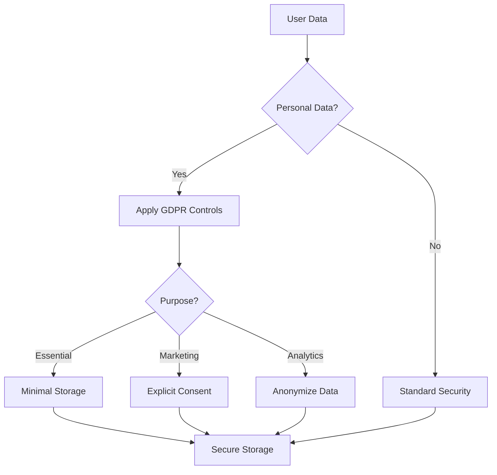

# Secret Trees Access Control Matrix

## Documentation Access Levels

| Role | Document Category | Access Level | Responsibility |
|------|------------------|--------------|----------------|
| Developers | Technical Documentation | Read/Write | Implementation and technical maintenance |
| Developers | Business Documentation | Read | Technical alignment with business goals |
| Legal Team | Legal & Compliance | Read/Write | Regulatory adherence and legal protection |
| Legal Team | Technical Documentation | Read | Legal implications of implementation |
| Investors | Business Model | Read | Investment decisions |
| Investors | Risk Assessment | Read | Risk evaluation |
| Project Managers | All Documentation | Read/Write | Overall project coordination |
| Auditors | All Documentation | Read | Verification and compliance checking |

## Document Categories

### Technical Documentation
- [[06-Technical-Platform]]
- [[07-AI-Automation]]
- [[03-Tokenization-Strategy]]
- Technical specifications
- API documentation
- Infrastructure design

### Business Documentation
- [[08-Business-Model]]
- [[10-Investor-Pitch]]
- Market analysis
- Financial projections
- Partnership agreements

### Legal & Compliance
- [[04-Legal-Compliance]]
- Regulatory filings
- Compliance reports
- Legal opinions
- Contract templates

### Risk Management
- [[09-Risk-Assessment]]
- Risk-Assessments/* (all files in directory)
- Security audits
- Contingency plans

## GDPR Compliance Guidelines

### Data Classification

| Data Type | Classification | Storage Location | Retention Period |
|-----------|---------------|------------------|------------------|
| User Account Info | Personal | Encrypted Database | Account Duration + 90 Days |
| Transaction Records | Business Critical | Blockchain | Permanent |
| Verification Data | Business Critical | Encrypted Cloud Storage | 7 Years |
| Analytics Data | Internal Use | Pseudonymized Database | 2 Years |
| Website Logs | Operational | Rotating Log Files | 30 Days |

## Implementation in Access Controls

1. **Git Repository Access**
   - Technical branches: Developer access
   - Documentation branches: Role-based access
   - Master branch: Approval required

2. **Obsidian Vault Synchronization**
   - Use `.obsidian/workspace.json` to manage view access
   - Implement separate vaults for sensitive information
   - Use plugin permissions judiciously

3. **Export Controls**
   - PDF exports: Add watermarks for sensitive documents
   - Public documentation: Review process before publication
   - Investment materials: Versioning and recipient tracking 