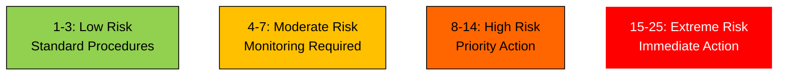
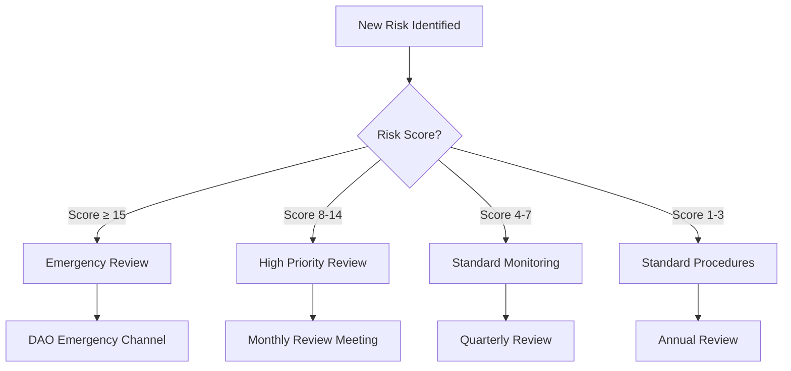

# Dynamic Risk Matrix

## Current Risk Distribution



## Risk Heat Map

| Likelihood\Severity | Negligible (1) | Minor (2) | Moderate (3) | Major (4) | Catastrophic (5) |
| :-- | :-- | :-- | :-- | :-- | :-- |
| **Almost Certain (5)** | 5 | 10 | 15 | 20 | 25 |
| **Likely (4)** | 4 | 8 | 12 | 16 | 20 |
| **Possible (3)** | 3 | 6 | 9 | 12 | 15 |
| **Unlikely (2)** | 2 | 4 | 6 | 8 | 10 |
| **Rare (1)** | 1 | 2 | 3 | 4 | 5 |

## Risk Workflow



## Critical Risks by Category

```dataview
TABLE WITHOUT ID 
    link(file.link) as "Risk", 
    severity as "Severity",
    probability as "Probability",
    severity * probability as "Score",
    owner as "Owner"
FROM "Risk-Assessments"
WHERE severity * probability >= 15
SORT severity * probability DESC
```

## High Priority Risks

```dataview
TABLE WITHOUT ID 
    link(file.link) as "Risk", 
    risk_category as "Category",
    severity * probability as "Score",
    owner as "Owner"
FROM "Risk-Assessments"
WHERE severity * probability >= 8 AND severity * probability < 15
SORT severity * probability DESC
```

## Risk Response Time Requirements

| Risk Level | Response Time | Review Frequency | Approval Level |
| :-- | :-- | :-- | :-- |
| Extreme (15-25) | 24-48 hours | Weekly | Executive + DAO |
| High (8-14) | 1 week | Monthly | Director |
| Moderate (4-7) | 2 weeks | Quarterly | Manager |
| Low (1-3) | 1 month | Annually | Team Lead | 