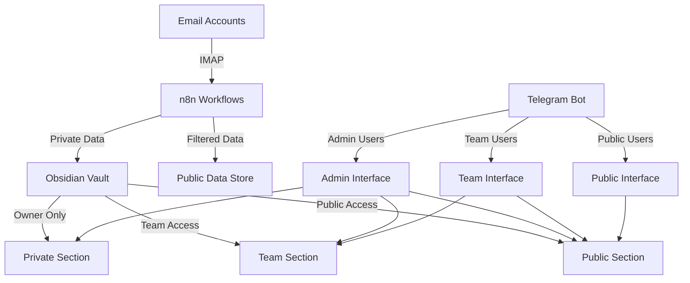

# Email and Telegram Security Boundaries

This document outlines the security model and separation of concerns between email processing and Telegram bot functionality in the Secret Trees project.

## Core Principles

1. **Separation of Concerns**: Email processing and Telegram bot functionality should be strictly separated.
2. **Privacy by Design**: Private data should never flow to less secure channels.
3. **Role-based Access Control**: Content access should be determined by user roles.
4. **Data Minimization**: Only necessary data should be shared across interfaces.

## System Architecture



## Email Processing

### Privacy Levels

Email accounts are configured with one of the following privacy levels:

- **Private**: Only visible to account owner (admin)
- **Team**: Visible to team members and admins
- **Public**: Visible to all users

### Time Management Data

Special attention is required for time management data extracted from emails:

1. **Extraction**: Performed exclusively by n8n workflows
2. **Storage**: Stored in Obsidian with appropriate privacy tags
3. **Access Control**: Enforced by both Obsidian and Telegram bot

## Telegram Bot Security

### User Roles

- **Admin**: Full access to all data
- **Team**: Access to team and public data
- **Public**: Access only to public data

### Command Security

| Command | Access Level | Data Accessed |
|---------|--------------|--------------|
| /about, /carbon, /contact, /help, /update | Public | Public information only |
| /roadmap, /updates, /schedule | Team | Team-level information |
| /ip, /financials, /partners | Admin | Sensitive project information |

### Implementation Requirements

1. All commands must verify user role before executing
2. Private data must be filtered before sending to team users
3. Commands like `/schedule` must never directly access email data
4. Non-admin users should never see data from private email accounts

## Proper Data Flow

### Correct Pattern

```
Email → n8n → Obsidian (with privacy tags) → Filtered API → Telegram Bot
```

### Incorrect Pattern (Never Do This)

```
Email → Telegram Bot (direct access)
```

## Technical Implementation

### Email Processing

- Use n8n workflows for all email processing
- Apply privacy filters at the workflow level
- Store in appropriate vault locations based on privacy level

### Telegram Bot

- Verify user roles for every command
- Request only filtered data from Obsidian
- Implement separate fallback data for each privacy level
- Never expose private email addresses or content

## Future Improvements

1. Implement cryptographic separation of private content
2. Create dedicated microservices for each privacy domain
3. Implement audit logging for all access to sensitive data
4. Develop formal privacy impact assessment process

## Compliance Requirements

This security model helps ensure compliance with:

- GDPR data minimization principles
- Need-to-know information access
- Data protection by design and default

---

> [!note]
> This document should be reviewed and updated whenever changes are made to the email processing or Telegram bot functionality. 