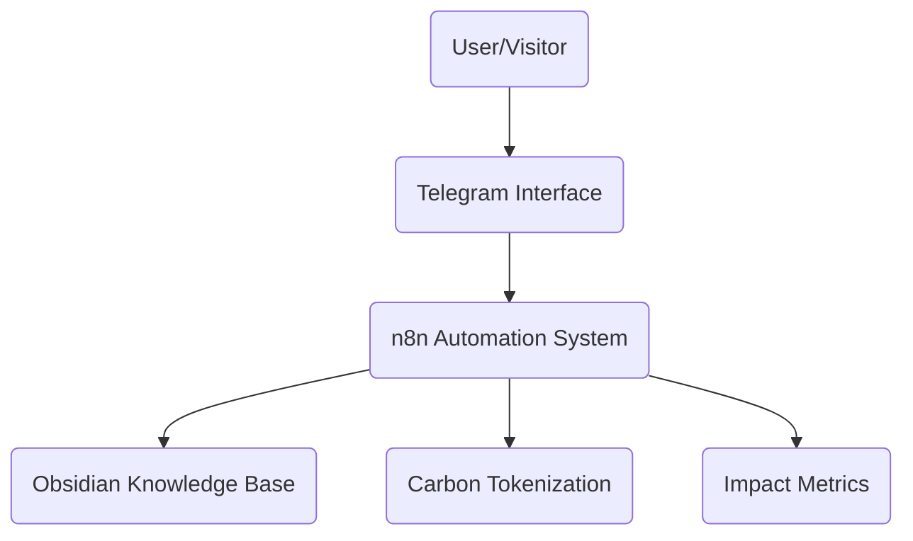

# Secret Trees: Sustainable Eco-Tourism & Carbon Impact

## Project Overview

Secret Trees is an innovative project in Latvia combining sustainable eco-tourism with transparent carbon impact tracking through tokenization technology. Our approach integrates:

1. **Sustainable Practices** - Implementing carbon-positive methodologies
2. **Carbon Credit Tokenization** - Blockchain-based verification and transparency
3. **Immersive Eco-Tourism** - Educational sustainability experiences
4. **Impact Tracking** - Real-time monitoring of environmental metrics based on the hempcrete offset in local cottages.

## Current Status

We are currently in the Enhancement phase of our development (April 2025):

- ✅ **Foundation Phase** - Completed infrastructure setup, team formation, and concept validation
- 🔄 **Enhancement Phase** - Building systems, refining carbon methodology, and developing tokenization
- 🔜 **Scaling Phase** - Expanding offsetting projects, launching token platform, and opening to visitors, investors and true eco warriors to base gems in sustainable and healthy micro offices made of hemp

## Technical Platform

Secret Trees employs a modern technical infrastructure:

Our system architecture prioritizes:
- Transparency of all carbon impact claims
- Security through multi-tier access controls
- Automation of documentation and tracking
- Open verification of environmental impacts

## Carbon Methodology

We follow established carbon verification standards:
- Aligned with Verified Carbon Standard (VCS) methodologies
- Adherence to ISO 14064-2 for project-level GHG quantification
- Compliance with EU Taxonomy technical screening criteria

## Visit & Participate

Our eco-tourism facilities (opening Q4 2025) will offer visitors:
- Immersive sustainability education experiences
- Transparent demonstration of carbon-positive practices
- Direct participation in environmental impact through tokenization

## Contact

For more information about the Secret Trees project:
- Email: contact@secrettrees.io
- Website: https://secrettrees.io

---

This project is committed to transparency, sustainability, and measurable environmental impact. 