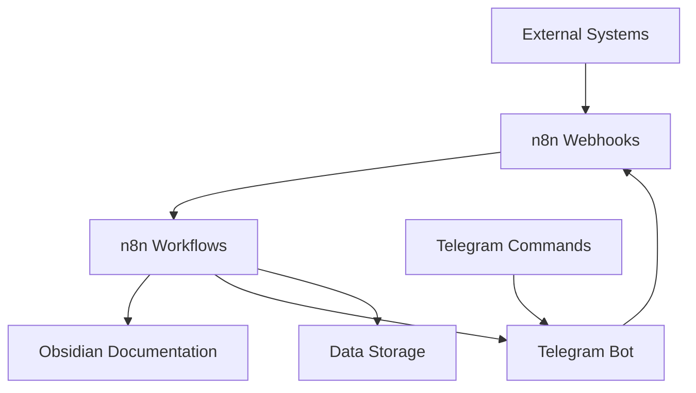

# n8n Webhook Configuration Guide

This document explains how to configure webhook nodes in n8n workflows to ensure proper integration between systems.

## Prerequisites

- n8n server running on localhost:5678
- Access to the n8n web interface
- Admin privileges in n8n

## Configuration Steps

### 1. Access n8n Interface

Open your browser and navigate to: http://localhost:5678

### 2. Find the Workflows

In the left sidebar, click on "Workflows" to see the list of all workflows. You should see the following workflows:

- Secret Trees Echo Assistant (ID: bEzczYvRDSz9Pc9O)
- Carbon Data Tracker (ID: sI98Bmo8ccsKcJro)
- AI Knowledge Base Assistant (ID: MIN6Xnfoc3nkihM8)
- Obsidian Integration (ID: 79ekrxuSE78LSGKF)

### 3. Configure Webhook Nodes

For each workflow, follow these steps:

1. Click on the workflow name to open it
2. Find the Webhook node (usually the first node in the workflow)
3. Double-click the Webhook node to open its settings
4. Set the following parameters:
   - **Authentication:** None (for internal use) or Basic Auth (for external use)
   - **HTTP Method:** POST
   - **Path:** Use the recommended path matching the workflow name:
     - `secret-trees-echo-assistant` for the Echo Assistant workflow
     - `carbon-data-tracker` for the Carbon Data Tracker workflow
     - `ai-knowledge-base-assistant` for the Knowledge Base Assistant workflow
     - `obsidian-integration` for the Obsidian Integration workflow
   - **Response Mode:** Last Node
5. Click "Save" to apply the changes
6. Make sure the workflow is active (toggle in the top-right corner should be ON)

### 4. Testing the Webhooks

After configuring each webhook, you can test them using curl commands:

```bash
# Test Echo Assistant
curl -X POST "http://localhost:5678/webhook/secret-trees-echo-assistant" \
  -H "Content-Type: application/json" \
  -d '{"query": "What is Secret Trees?"}'

# Test Knowledge Base
curl -X POST "http://localhost:5678/webhook/ai-knowledge-base-assistant" \
  -H "Content-Type: application/json" \
  -d '{"query": "How does carbon tokenization work?"}'

# Test Carbon Data Tracker
curl -X POST "http://localhost:5678/webhook/carbon-data-tracker" \
  -H "Content-Type: application/json" \
  -d '{"carbonSequestered": 130, "forestedArea": 8.7}'

# Test Obsidian Integration
curl -X POST "http://localhost:5678/webhook/obsidian-integration" \
  -H "Content-Type: application/json" \
  -d '{"file": "test.md", "operation": "create", "content": "# Test\nThis is a test file"}'
```

### 5. Common Issues and Solutions

#### Webhook Not Found (404)

If you receive a 404 error message:
- Verify the workflow is active (green toggle switch)
- Check that the webhook path exactly matches what you configured
- Make sure n8n is running (`ps aux | grep n8n`)

#### CORS Issues

If external applications need to access webhooks:
- Enable CORS in the webhook node settings
- Set "Response Headers" to include:
  ```
  Access-Control-Allow-Origin: *
  Access-Control-Allow-Methods: POST, GET, OPTIONS
  Access-Control-Allow-Headers: Content-Type
  ```

#### Authentication Failures

If using Basic Auth:
- Make sure to include the correct credentials in the request
- Use the format: `-u "username:password"`

## Webhook System Architecture



## Best Practices

1. **Standardize Paths**: Use consistent naming patterns for webhook paths
2. **Validate Input**: Add a Function node after webhooks to validate incoming data
3. **Secure Sensitive Endpoints**: Use authentication for any endpoints that modify data
4. **Monitor Activity**: Regularly check n8n execution logs for webhook activity
5. **Test Regularly**: Create automated tests that verify webhook functionality

---

> [!tip]
> Consider setting up a reverse proxy (like Nginx) in front of n8n for additional security and to enable HTTPS for production use. 