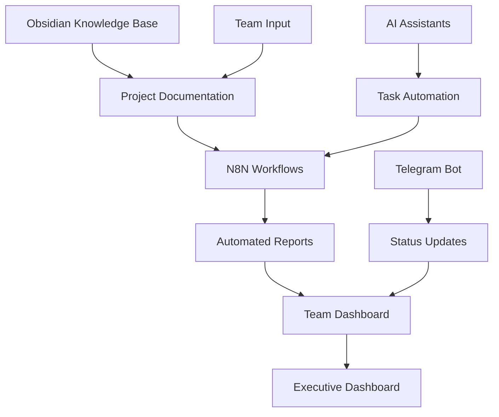

# Secret Trees Project Management Framework

This document outlines our enterprise-grade project management approach for the Secret Trees initiative, combining agile methodologies with structured oversight.

## Project Structure Overview

### 1. Governance Model

**Steering Committee**
- Quarterly strategic reviews
- Resource allocation decisions
- Major milestone approvals

**Project Management Office (PMO)**
- Weekly progress tracking
- Risk management
- Cross-team coordination

**Development Teams**
- Daily standups (15 minutes)
- Bi-weekly sprint planning
- End-of-sprint retrospectives

### 2. Planning Hierarchy

**Strategic Roadmap** (12-18 months)
- High-level business objectives
- Major milestones and dependencies
- Resource forecasting

**Quarterly Plans** (3 months)
- Specific deliverables per quarter
- Team capacity allocation
- Success metrics and KPIs

**Sprint Plans** (2 weeks)
- Task-level breakdown
- Story points and effort estimates
- Individual assignments

## Workflow Management

### 1. Project Tracking

| Level | Tool | Update Frequency | Key Metrics |
|-------|------|------------------|------------|
| Executive | Dashboard | Weekly | Budget variance, milestone completion |
| Management | Detailed reports | Bi-weekly | Velocity, burndown, risks |
| Team | Sprint board | Daily | Tasks completed, blockers |

### 2. Technology Integration

Our workflow automation stack includes:
- N8N for workflow orchestration
- Obsidian for knowledge management
- Telegram for team communication
- AI assistants for routine tasks

### 3. Meeting Cadence

**Steering Committee**
- Monthly reviews (1 hour)
- Quarterly deep dives (4 hours)

**Team Leads**
- Weekly coordination (30 minutes)
- Bi-weekly planning (2 hours)

**Development Teams**
- Daily standups (15 minutes)
- Sprint planning/review (1 hour)
- Monthly retrospectives (1 hour)

## Decision-Making Framework

### 1. Decision Levels

**Strategic Decisions**
- Impact: Long-term direction, significant resources
- Approval: Steering committee
- Timeline: 2-4 weeks

**Tactical Decisions**
- Impact: Current quarter deliverables, resource allocation
- Approval: Project management + team leads
- Timeline: 2-7 days

**Operational Decisions**
- Impact: Sprint-level tasks, technical approaches
- Approval: Team leads or individual contributors
- Timeline: Same-day

### 2. Decision Documentation

All decisions should be documented with:
- Context and business drivers
- Options considered
- Selected approach with rationale
- Implementation timeline
- Success metrics

## Status Reporting

### 1. Executive Dashboard

Updated weekly with:
- Overall project health (Red/Yellow/Green)
- Progress against quarterly objectives
- Budget tracking
- Key risks and mitigation strategies

### 2. Team Dashboard

Updated daily with:
- Sprint progress
- Task completion
- Blockers and dependencies
- Code quality metrics

### 3. Automated Reporting

Our n8n workflows generate:
- Daily activity summaries
- Weekly progress reports
- Resource utilization analysis
- Trend analysis of key metrics

## Risk Management

### 1. Risk Register

Maintained with:
- Risk description
- Impact score (1-5)
- Probability score (1-5)
- Overall priority (Impact × Probability)
- Mitigation strategy
- Owner
- Timeline

### 2. Risk Categories

- Technical (implementation challenges)
- Resource (staffing, tools)
- Schedule (timeline feasibility)
- External (market, regulatory)
- Operational (process efficiency)

## Resource Management

### 1. Team Capacity Planning

- Quarterly capacity forecasting
- Skills matrix maintenance
- Allocation percentages across projects

### 2. Budget Tracking

- Monthly financial reviews
- Variance analysis
- Forecast to completion

## Continuous Improvement

### 1. Metrics Collection

- Sprint velocity
- Defect rates
- Cycle time
- Lead time
- Customer satisfaction

### 2. Retrospective Process

- End of each sprint
- Monthly team reviews
- Quarterly program retrospectives

### 3. Process Optimization

- Documented process changes
- A/B testing of workflow improvements
- Automation of repetitive tasks

## Project Management Tools Integration

Our toolchain integration ensures seamless information flow:

## Implementing This Framework

1. **Start Small**: Begin with daily standups and basic tracking
2. **Add Structure**: Implement formal sprint planning
3. **Scale Governance**: Add steering committee oversight as project grows
4. **Automate**: Use n8n workflows to reduce manual reporting
5. **Optimize**: Continuously improve based on team feedback

---

> [!note]
> This framework should be adapted to the specific needs of the Secret Trees project and refined over time based on team feedback and project requirements. 