# Secret Trees System Architecture

This document provides a clear visual overview of how the Secret Trees project components interact with each other.

## System Components Overview

```mermaid
graph TD
    %% Main components with distinct colors
    User(["👤 User/Team"]):::userStyle
    Dev(["👨‍💻 Developer"]):::devStyle
    TelegramBot["📱 Telegram Bot<br>@treekeeper_bot"]:::botStyle
    n8n["⚙️ n8n Server<br>localhost:5678"]:::n8nStyle
    Obsidian["📚 Obsidian Vault"]:::obsidianStyle
    GitHub["🔄 GitHub Repository"]:::githubStyle
    
    %% n8n Workflows as simple nodes
    AI["AI Knowledge<br>Assistant"]:::workflowStyle
    Echo["Echo Assistant"]:::workflowStyle
    Carbon["Carbon Tracker"]:::workflowStyle
    ObsInt["Obsidian Integration"]:::workflowStyle
    
    %% Basic Connections
    User -->|"Sends commands<br>& queries"| TelegramBot
    TelegramBot -->|"Forwards requests"| n8n
    n8n -->|"Manages workflows"| AI
    n8n -->|"Manages workflows"| Echo
    n8n -->|"Manages workflows"| Carbon
    n8n -->|"Manages workflows"| ObsInt
    
    %% Knowledge & Version Control
    ObsInt -->|"Updates"| Obsidian
    Obsidian -->|"Provides knowledge"| AI
    GitHub -->|"Provides code"| n8n
    
    %% Developer Actions
    Dev -->|"Updates code"| GitHub
    Dev -->|"Configures"| n8n
    Dev -->|"Documents"| Obsidian
    
    %% Response Flow
    AI -->|"Intelligent responses"| TelegramBot
    Echo -->|"Simple answers"| TelegramBot
    TelegramBot -->|"Displays messages"| User
    
    %% Styles
    classDef userStyle fill:#f9f,stroke:#333,stroke-width:2px
    classDef devStyle fill:#bbf,stroke:#333,stroke-width:2px
    classDef botStyle fill:#fdb,stroke:#333,stroke-width:2px
    classDef n8nStyle fill:#bfb,stroke:#333,stroke-width:2px
    classDef obsidianStyle fill:#dcf,stroke:#333,stroke-width:2px
    classDef githubStyle fill:#cdf,stroke:#333,stroke-width:2px
    classDef workflowStyle fill:#ddd,stroke:#333,stroke-width:1px
```

## Information Flow

```mermaid
flowchart LR
    %% Simplified flow with icons and clear direction
    A(["👤 User"]):::user --> |"1. Sends query"| B["📱 Telegram Bot"]:::bot
    B --> |"2. Forwards"| C["⚙️ n8n Workflows"]:::n8n
    C --> |"3. Retrieves data"| D["📚 Knowledge Base"]:::kb
    D --> |"4. Returns info"| C
    C --> |"5. Processes"| E["🧠 AI Assistant"]:::ai
    E --> |"6. Answers"| C
    C --> |"7. Formats"| B
    B --> |"8. Displays"| A
    C -.-> |"Logs & Updates"| F["📝 Obsidian Docs"]:::docs
    
    classDef user fill:#f9f,stroke:#333
    classDef bot fill:#fdb,stroke:#333
    classDef n8n fill:#bfb,stroke:#333
    classDef kb fill:#dcf,stroke:#333
    classDef ai fill:#bbf,stroke:#333
    classDef docs fill:#ddd,stroke:#333
```

## Developer Workflow

## Component Details

### 1. Telegram Bot (@treekeeper_bot)
- **Purpose**: User interface for interacting with the system
- **Features**: Command processing, security tiers, natural language queries
- **Implementation**: Node.js using Telegram Bot API with polling method

### 2. n8n Workflow Engine
- **Running on**: http://localhost:5678
- **Active Workflows**:
  - AI Knowledge Base Assistant (ID: MIN6Xnfoc3nkihM8)
  - Secret Trees Echo Assistant (ID: bEzczYvRDSz9Pc9O)
  - Carbon Data Tracker (ID: sI98Bmo8ccsKcJro)
  - Obsidian Integration (ID: 79ekrxuSE78LSGKF)

### 3. Obsidian Vault
- **Purpose**: Knowledge repository and documentation
- **Organization**: Security frontmatter tags (public, team, admin)
- **Key Areas**: Project documentation, carbon methodology, technical specs

### 4. GitHub Repository
- **Purpose**: Version control and code collaboration
- **Contents**: Bot code, configuration files, automation scripts
- **Integration**: Syncs with other components via webhooks

## Security Model

```mermaid
flowchart TD
    %% Simplified security model with clear levels
    A[Security System]:::main
    
    A --> B["🌍 Public Level<br>(Basic Access)"]:::public
    A --> C["👥 Team Level<br>(Project Info)"]:::team
    A --> D["🔒 Admin Level<br>(Sensitive Data)"]:::admin
    
    classDef main fill:#ccc,stroke:#333,stroke-width:2px
    classDef public fill:#bfb,stroke:#333
    classDef team fill:#fdb,stroke:#333
    classDef admin fill:#f99,stroke:#333
```

## How to Extend the System

1. **Add new Telegram commands**: Extend the bot.js file
2. **Create new knowledge areas**: Add documentation to Obsidian
3. **Enhance AI capabilities**: Modify n8n AI Knowledge Base Assistant workflow
4. **Add data processing**: Extend Carbon Data Tracker workflow
5. **Improve automation**: Enhance Obsidian Integration workflow

## Next Development Priorities

1. Create automated daily summaries of bot interactions
2. Implement analytics tracking for bot usage
3. Set up automated backups of workflow configurations
4. Integrate carbon data collection with visualization dashboard

---

> [!note]
> This architecture document is maintained by the technical team and should be updated whenever significant system changes are made. 