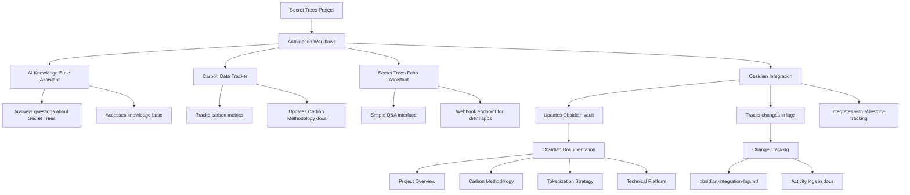

# Secret Trees Workflow Automation Map

## Overview
This document maps out how our n8n automation workflows are set up to track project work and integrate with Obsidian documentation.



## Workflow Details

### 1. AI Knowledge Base Assistant
- **Current status**: Active
- **Purpose**: Provides intelligent responses about Secret Trees project
- **Integration**: Can be queried via webhook endpoint
- **Usage**: Send POST requests with `{"query": "Tell me about eco-tourism"}` format

### 2. Carbon Data Tracker
- **Current status**: Active
- **Purpose**: Tracks and updates carbon sequestration metrics
- **Integration**: Updates Obsidian vault with current carbon data
- **Usage**: Automatically runs on schedule or can be triggered via webhook

### 3. Secret Trees Echo Assistant
- **Current status**: Active
- **Purpose**: Simple Q&A interface for basic project information 
- **Integration**: Accessible via webhook for external applications
- **Usage**: Send POST requests with `{"query": "question here"}` format

### 4. Obsidian Integration
- **Current status**: Active
- **Purpose**: Updates Obsidian vault with project data and tracks changes
- **Integration**: Central hub connecting automation with documentation
- **Usage**: Triggered by other workflows or externally via webhook

## Documentation Structure
The automation system interacts with the following key documents:

- **01-Carbon-Methodology.md**: Contains carbon metrics and methodology
- **06-Technical-Platform.md**: Technical documentation, updated with development activity
- **07-AI-Automation.md**: Documents AI capabilities and integration points
- **Milestone-Dashboard.md**: Tracks project milestones and status updates
- **obsidian-integration-log.md**: Complete audit log of all documentation changes

## Tracking System

Changes to documentation are tracked through a structured system:
1. All updates are timestamped and logged in `obsidian-integration-log.md`
2. Each modification includes:
   - Timestamp (ISO format)
   - Operation type (create, append, replace, read)
   - Target file
   - Status (SUCCESS or ERROR)

## Usage Examples

> **Note:** The webhook endpoints need to be configured in the n8n UI for each workflow. 
> The paths below represent the recommended URL paths but may need to be set up or verified in the n8n interface.
> To configure webhooks: Open each workflow in n8n and check the webhook node settings.

### Update Carbon Data
```bash
curl -X POST "http://localhost:5678/webhook/carbon-data-tracker" \
  -H "Content-Type: application/json" \
  -d '{"carbonSequestered": 130, "forestedArea": 8.7}'
```

### Query Knowledge Base
```bash
curl -X POST "http://localhost:5678/webhook/ai-knowledge-base-assistant" \
  -H "Content-Type: application/json" \
  -d '{"query": "How does carbon tokenization work?"}'
```

### Echo Assistant Query
```bash
curl -X POST "http://localhost:5678/webhook/secret-trees-echo-assistant" \
  -H "Content-Type: application/json" \
  -d '{"query": "Tell me about Secret Trees"}'
```

### Update Obsidian Documentation
```bash
curl -X POST "http://localhost:5678/webhook/obsidian-integration" \
  -H "Content-Type: application/json" \
  -d '{"file": "Milestone-Dashboard.md", "operation": "append", "content": "## New Milestone\n- Completed forest survey"}'
```

## Workflow IDs for Reference

| Workflow Name | ID | 
|--------------|-----------------|
| Secret Trees Echo Assistant | bEzczYvRDSz9Pc9O |
| Carbon Data Tracker | sI98Bmo8ccsKcJro |
| AI Knowledge Base Assistant | MIN6Xnfoc3nkihM8 |
| Obsidian Integration | 79ekrxuSE78LSGKF |

_Updated: May 1, 2025_ 